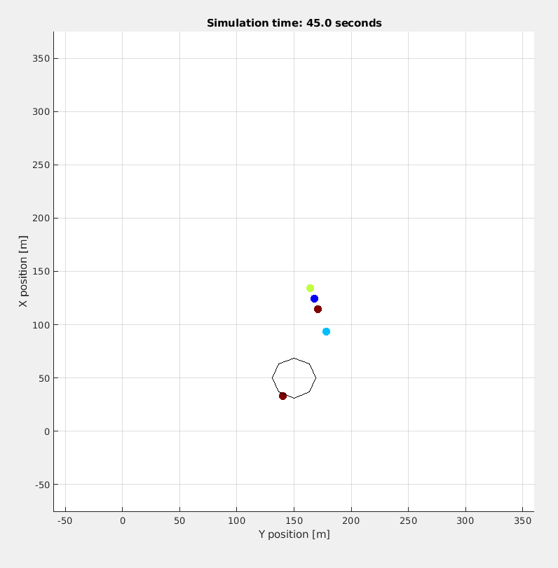
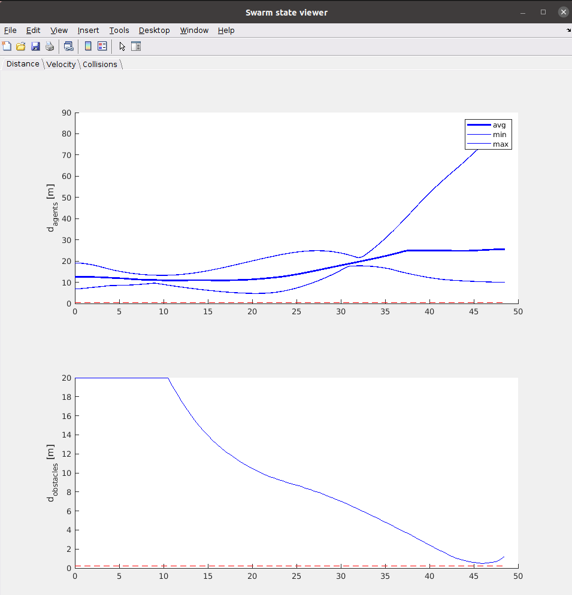
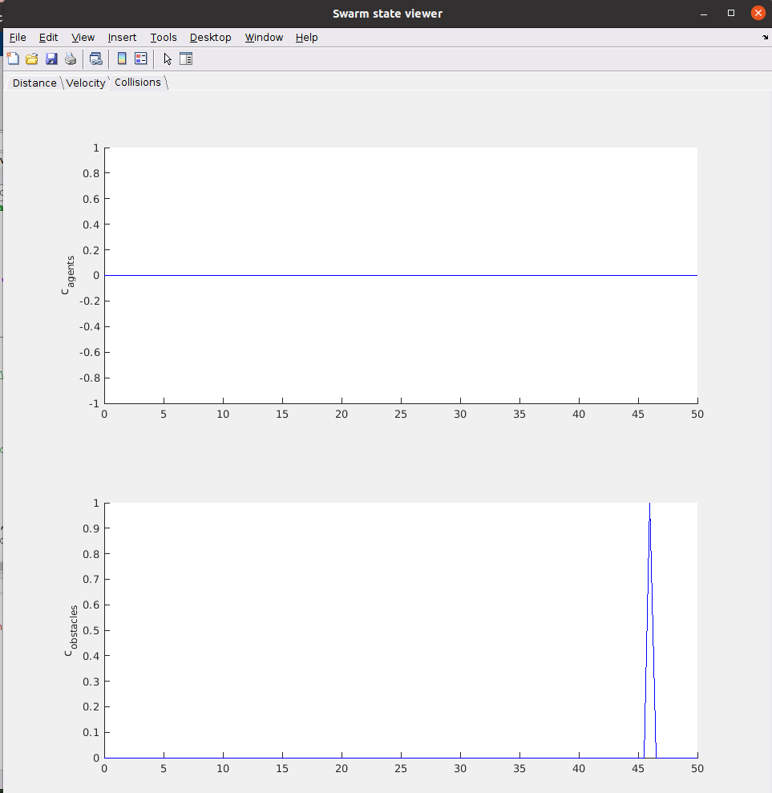

# SwarmFuzz

SwarmFuzz is a fuzzing framework to efficiently find SPVs (Swarm Propagation Vulnerabilities) in drone swarms. It uses a combination of graph theory and gradient-guided optimization to find the potential attack parameters. 

For more details about SwarmFuzz, please refer to the paper published in DSN 2023 ["SwarmFuzz: Discovering GPS Spoofing Attacks in Drone Swarms"](https://blogs.ubc.ca/dependablesystemslab/2023/03/18/swarmfuzz-discovering-gps-spoofing-attacks-in-drone-swarms/).


## Get started

### 1) Requirement
Matlab R2022b with the Statistics and Machine Learning Toolbox. 

### 2) Clone the repository
We use [Swarmlab](https://github.com/lis-epfl/swarmlab) as the simulator for drone swarms.
```
git clone https://github.com/lis-epfl/swarmlab.git
git clone https://github.com/DependableSystemsLab/SwarmFuzz.git
```
Suppose that the Swarmlab repository is under the path `swarmlab`, and the SwarmFuzz repository is under the path `SwarmFuzz`.


### 3) Change the Swarmlab accordingly
We have to copy SwarmFuzz into the Swarmlab folder and also change some settings in Swarmlab to record the swarm's state.

Run the following commands
```
cp -r SwarmFuzz/fuzz/ swarmlab
cp SwarmFuzz/changed_swarmlab/compute_vel_vasarhelyi.m swarmlab/@Swarm
cp SwarmFuzz/changed_swarmlab/param_swarm.m swarmlab/parameters/
cp SwarmFuzz/changed_swarmlab/example_vasarhelyi.m swarmlab/examples/examples_swarm/
cp SwarmFuzz/changed_swarmlab/Swarm.m swarmlab/@Swarm
cp SwarmFuzz/changed_swarmlab/create_shifted_buildings.m swarmlab/graphics/graphics_map/
```
### 4) Open Swarmlab
Under `swarmlab/`, open MATLAB, 

```
cd swarmlab
matlab
```
### 5) Run SwarmFuzz
In the command window in MATLAB, run the following command
```
cd fuzz/
swarmfuzz(200, 201, 5, 5) 
```

The arguments for the `fuzz` function are `(seedStart, seedEnd, dev, nb)`
- `seedStart`: the seed for the first mission 
- `seedEnd`: the seed for the last mission
- `dev`: GPS spoofing deviation
- `nb`: number of drones in the swarm
Therefore, by running `fuzz(200, 201, 5, 5)`, we are fuzzing the 5-drone swarm missions with seed 200 and 201, with the 5m GPS spoofing deviation.

### 6) Interprete the result
- `fuzz/seedpools/pool{seed}.csv`: Generated seedpool for each mission. Each row represents `[target_id, victim_id, deviation_direction, spoofing_time]`. The number of rows represents the number of potential target-victim drone pairs in this mission.
- `fuzz/attResults/att_results{seed}.csv`: Attack results found by SwarmFuzz for each mission. Each row represents `[collision_or_not, init_VDO, current_VDO, spoofing_start_time, spooing_duration, target_id, victim_id, spooing_deviation]`. The number of rows present the attack results for each seed.
- `fuzz/search/iteration{seed}.csv`: Results for each gradient descent search iteration. The number of rows represents the overhead of the fuzzing, i.e., the number of iterations taken to find the attack.  


## Configurations
- The default number of drones in the swarm is 5, if you want to test the swarm of 10/15 drones, do the following:
    - Change the `nb` argument according when calling `swarmfuzz(seedStart, seedEnd, dev, nb)`
    - In the file `parameters/param_swarm.m`, change the variable `p_swarm.nb_agents`.
    - In the file `@Swarm/Swarm.m`, in the function `get_colors(self)`, change `colors` to be an array with 10/15 rows. You can specify the color as you like.

## Collision cases found by SwarmFuzz
Some collision cases found by SwarmFuzz are stored in folder `./collision_cases`. Here are the steps to reproduce and visualize the collisions based on the `att_resultsxxx.csv` file. For example, if we want to reproduce `collision_cases/5drones/5m/att_results216.csv`, do the following:
- Find the row whose first parameter (i.e., `collision_or_not`) is 1, which means that collision occurs. In our example, the row is `1,5.72422801639505,0.501927503804293,4.09705120045216,18.022326120527,4,5,5`.
- Under `swarmlab/examples/examples_swarm/`, first create an folder called `./output`, and then create an empty txt file called `tmp.txt` under `swarmlab/examples/examples_swarm/output/`. Run 
```
./example_vasarhelyi(4.09705120045216,18.022326120527, 4, 5,5,216, './output/tmp.txt', './output/tmp.txt', './output/tmp.txt', './output/tmp.txt')
```

In the above command, the GPS spoofing attack starts at `4.09705120045216`s with the duration of `18.022326120527`s. The target drone is No.`4`. The victim drone is No.`5`. The GPS spoofing deviation is `5`m with the right(i.e. `1`) direction. The seed for the mission is `216`. The `./otput/tmp.txt` is just a file to store intermediate results.
- At around 45s, we can observe that the drone collides with the obstacle. The screenshot of the simulator is attached.





## Citations
If you find this code useful, please consider citing our paper.
C
```
@INPROCEEDINGS{swarmfuzz,
  author={Yao, Yingao(Elaine) and Dash, Pritam and Pattabiraman, Karthik},
  booktitle={2023 53st Annual IEEE/IFIP International Conference on Dependable Systems and Networks (DSN)}, 
  title={SwarmFuzz: Discovering GPS Spoofing Attacks in Drone Swarms}, 
  year={2023}}
```


## Contact
For questions about our paper or this code, please open an issue or contact Elaine Yao (elainedv111@gmail.com)